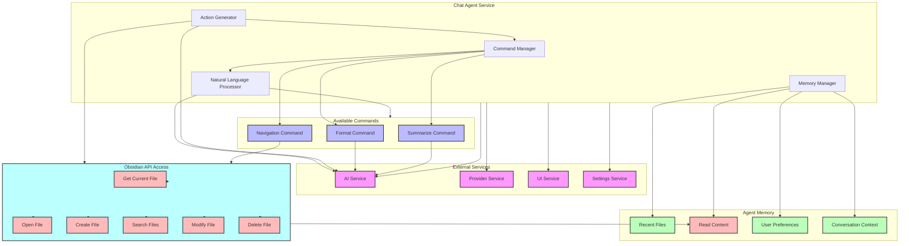

# AI Agent Architecture

This document outlines the architecture of the AI Agent component in our Obsidian plugin.

## Component Overview



## Component Descriptions

### Chat Agent Service
- **Command Manager**: Handles registration and execution of commands
- **Natural Language Processor**: Analyzes user input for command intent using LLM
- **Memory Manager**: Maintains agent state and conversation history
- **Action Generator**: Creates and executes actions through Obsidian API

### Commands
- **Format**: Document formatting and organization
- **Summarize**: Document summary generation
- **Navigation**: File system navigation and content manipulation

### Memory
- **Recent Files**: Tracks recently accessed files
- **Recent Commands**: Command execution history
- **User Preferences**: Stored user settings
- **Conversation Context**: Maintains chat context

### External Services
- **AI Service**: LLM integration for NLP and content generation
- **Provider Service**: Plugin provider management
- **UI Service**: User interface components
- **Settings Service**: Configuration management

### Obsidian API Access
The agent has access to the following Obsidian API capabilities:
- **Get Current File**: Access to currently open file
- **Read Content**: Read file content for analysis
- **Open File**: Open files in the editor
- **Create File**: Create new files
- **Search Files**: Search through vault files
- **Modify File**: Update file content
- **Delete File**: Remove files from vault

## Interaction Flow

1. User input is received by the Chat Agent Service
2. Natural Language Processor analyzes the input using AI Service
3. Command Manager identifies and executes relevant commands
4. Memory Manager updates state based on actions
5. Action Generator executes actions through Obsidian API
6. Results are returned through UI Service

## Key Features

- Dual-mode command recognition (explicit `/command` and natural language)
- Context-aware action generation
- Persistent memory management
- Full Obsidian API integration
- Service-oriented architecture

## API Integration

The Chat Agent Service integrates with Obsidian's API through:
- `app.vault` for file operations
- `app.workspace` for editor and view management
- `app.metadataCache` for file metadata
- Event listeners for file changes

## Implementation Details

### File Operations
```typescript
interface FileOperations {
    readFileContent(path: string): Promise<string>;
    openFile(path: string): Promise<void>;
    createFile(path: string, content: string): Promise<TFile>;
    searchFiles(query: string): TFile[];
    getCurrentFile(): TFile | null;
    modifyFile(path: string, content: string): Promise<void>;
    deleteFile(path: string): Promise<void>;
}
```

### Command Processing
```typescript
interface CommandProcessor {
    processMessage(content: string, context: DocumentContext): Promise<string>;
    executeCommand(command: string, args: string[]): Promise<void>;
    suggestActions(context: DocumentContext): Promise<string[]>;
}
```

### Memory Management
```typescript
interface MemoryManager {
    updateRecentFiles(file: TFile): void;
    trackCommand(command: string): void;
    getConversationContext(): string[];
    saveState(): Promise<void>;
}
```

## Usage Examples

1. File Reading:
```typescript
const content = await chatAgent.readFileContent('path/to/file.md');
```

2. Command Execution:
```typescript
const response = await chatAgent.processMessage('/format', context);
```

3. File Creation:
```typescript
const newFile = await chatAgent.createFile('new-note.md', content);
```

4. File Search:
```typescript
const files = chatAgent.searchFiles('query');
```

5. File Modification:
```typescript
await chatAgent.modifyFile('path/to/file.md', newContent);
```

The Chat Agent Service provides a robust interface between the user's natural language input and Obsidian's API capabilities, enabling powerful document management and content generation features while maintaining a clean and modular architecture. 