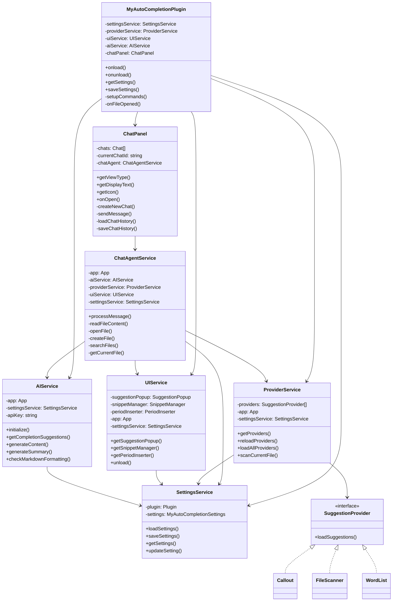
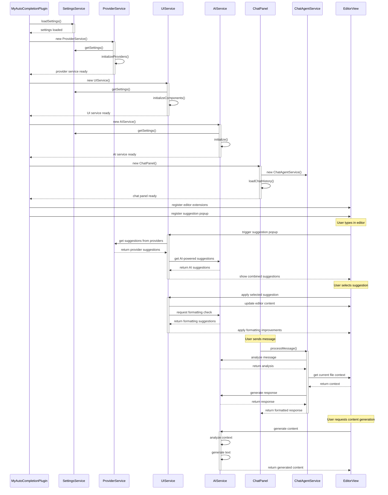

# Plugin Architecture

## Class Structure

## Interaction Flow

The architecture follows a modular design with six main services:

1. **SettingsService**
   - Manages plugin settings
   - Handles loading/saving settings
   - Provides settings access to other services

2. **ProviderService**
   - Manages suggestion providers (Callout, FileScanner, WordList)
   - Handles provider lifecycle
   - Coordinates provider operations

3. **UIService**
   - Manages UI components
   - Handles suggestion popup
   - Manages snippet and period insertion

4. **AIService**
   - Provides AI-powered completions and suggestions
   - Handles content generation and formatting
   - Manages API communication with AI service

5. **ChatPanel**
   - Manages chat interface UI
   - Handles chat history persistence
   - Provides model selection
   - Manages message display and input

6. **ChatAgentService**
   - Processes user messages
   - Manages file operations through Obsidian API
   - Coordinates between AI and UI services
   - Handles command detection and execution

The main plugin class (`MyAutoCompletionPlugin`) orchestrates these services and handles:
- Plugin lifecycle (load/unload)
- Command registration
- Editor extension setup
- Event listeners
- Chat panel integration

The interaction flow shows how these components work together when:
- The plugin loads
- The user types in the editor
- Suggestions are displayed and selected
- Content is generated or formatted
- Chat messages are processed and responded to 