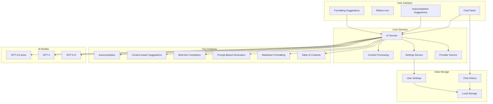

Product Requirements Document (PRD)

1. Overview

1.1 Background

The official obsidian-releases repository maintains a curated list of community plugins that extend the functionality of the Obsidian Markdown editor. While many plugins enhance Obsidian by providing features such as graph views, backlinks, and custom themes, none currently address intelligent, AI-powered content assistance.

1.2 The Problem We Solve

Users of Obsidian face challenges when creating and maintaining extensive documents:
	•	Time-consuming writing: Manually typing, formatting, and editing lengthy Markdown files can slow productivity.
	•	Consistency and quality: Ensuring consistent formatting, grammar, and style throughout documents is difficult.
	•	Navigation issues: Long notes lack auto-generated summaries or dynamic tables of contents, making them hard to navigate.
	•	Context switching: Users need to maintain focus while writing and accessing AI assistance.

The Obsidian Copilot Plugin leverages AI to offer real-time autocompletion, context-aware suggestions, Markdown formatting assistance, and content generation through an integrated chat interface. This streamlines the writing process, improves document quality, and enhances user productivity.

1.3 What We Add

Our plugin integrates with the Obsidian ecosystem as an official community plugin and provides:
	•	AI-Powered Autocompletion: Suggestions that adapt as the user types.
	•	Context-Aware Suggestions: In-depth analysis of the text to offer completions and ideas.
	•	Multi-line Completion: The ability to generate larger text blocks, including paragraphs or list items.
	•	Prompt-Based Content Generation: Creating content from brief user prompts.
	•	Markdown Formatting Assistance: Real-time detection and suggestions for correct Markdown syntax.
	•	Style and Grammar Improvement: Recommendations to improve writing clarity and consistency.
	•	Automatic Summaries & Dynamic Table of Contents: For easier navigation in lengthy documents.
	•	Integrated Chat Interface: A dedicated chat panel for direct AI interaction.
	•	Multiple AI Model Support: Choice between different GPT models (3.5-turbo, GPT-4, etc.).
	•	Advanced Context Processing: Intelligent analysis of document structure and content.
	•	Persistent Chat History: Local storage of chat conversations for reference.

1.4 System Architecture

2. Target Users
	•	Knowledge Workers & Researchers: Users managing extensive notes and research documents.
	•	Writers & Bloggers: Creatives who need inspiration and help with drafting content.
	•	Technical Writers & Developers: Professionals who require precise Markdown formatting and technical documentation.
	•	Students & Academics: Individuals looking for efficient note-taking and content generation tools.

3. User Stories

User Story 1: Intelligent Autocompletion
	•	As a writer,
	•	I want the plugin to provide AI-powered autocompletion,
	•	So that I can write more quickly without worrying about typos or incomplete sentences.
	•	Acceptance Criteria:
	•	Autocompletion suggestions appear in real time.
	•	Suggestions adapt based on the context (e.g., headings, code blocks, bullet lists).
	•	Multiple AI models available for different completion needs.

User Story 2: Context-Aware Writing Assistance
	•	As a researcher,
	•	I want context-aware suggestions while editing my notes,
	•	So that I can maintain consistency in tone and content throughout my document.
	•	Acceptance Criteria:
	•	The plugin analyzes the existing text and offers context-relevant completions.
	•	Suggestions include complete sentences or paragraphs that align with the ongoing narrative.
	•	Advanced document structure analysis for better context understanding.

User Story 3: Markdown Formatting and Syntax Support
	•	As a technical writer,
	•	I want the plugin to assist with proper Markdown formatting,
	•	So that my notes and documentation are both readable and correctly structured.
	•	Acceptance Criteria:
	•	Real-time syntax checking for Markdown elements (headings, links, lists, code blocks).
	•	Inline suggestions for corrections and formatting enhancements.
	•	Integration with the chat interface for formatting-related queries.

User Story 4: Prompt-Based Content Generation
	•	As a student,
	•	I want to provide a short prompt and have the plugin generate relevant content,
	•	So that I can overcome writer's block and quickly expand my ideas.
	•	Acceptance Criteria:
	•	The plugin accepts natural language prompts through both inline suggestions and chat interface.
	•	Users can customize the tone and style of the generated content.
	•	Multiple AI models available for different content generation needs.

User Story 5: Document Navigation Improvements
	•	As a knowledge worker,
	•	I want automatic summaries and a dynamic table of contents,
	•	So that I can easily navigate large documents.
	•	Acceptance Criteria:
	•	The plugin auto-generates a summary and a table of contents based on document structure.
	•	Updates to the table of contents occur in real time as the document is edited.
	•	Integration with the chat interface for document navigation queries.

User Story 6: Integrated Chat Interface
	•	As an Obsidian user,
	•	I want a dedicated chat interface for AI interactions,
	•	So that I can easily access AI assistance without disrupting my writing flow.
	•	Acceptance Criteria:
	•	Split-view integration with Obsidian's interface.
	•	Persistent chat history with local storage.
	•	Easy access through ribbon icon.
	•	Model selection for different AI capabilities.
	•	Context-aware responses based on current document.

4. Technical Implementation

4.1 Core Components
	•	Chat Panel Integration:
		◦	Split-view compatible chat interface
		◦	Model selection dropdown (GPT-3.5, GPT-4, etc.)
		◦	Local storage for chat history
		◦	Markdown rendering support
	•	Context Processing:
		◦	Document structure analysis
		◦	Heading hierarchy tracking
		◦	Previous paragraphs processing
		◦	Token optimization
	•	AI Service Integration:
		◦	Multiple model support
		◦	Context-based temperature adjustment
		◦	Efficient token usage
		◦	Error handling and retry logic

4.2 User Interface
	•	Ribbon icon for quick access
	•	Responsive chat panel design
	•	Theme-aware styling
	•	Intuitive message bubbles
	•	Real-time suggestions
	•	Model selection dropdown

5. Comparison to the Original Open Source Repo

The obsidian-releases repository is dedicated to curating and listing community plugins for Obsidian. While it contains a wide variety of plugins aimed at enhancing note-taking, graph visualizations, and theme customizations, it does not currently include a plugin that leverages AI for content generation and intelligent writing assistance. Our Obsidian Copilot Plugin is designed to complement this ecosystem by adding:
	•	AI-Powered Features: Providing advanced writing assistance not found in existing plugins.
	•	Content Generation: Generating content based on user prompts, an area not currently covered.
	•	Enhanced User Productivity: Through features like context-aware autocompletion and dynamic navigation tools.
	•	Integrated Chat Experience: A unique approach to AI assistance through a dedicated chat interface.
	•	Multiple AI Model Support: Flexibility in choosing AI capabilities based on user needs.

6. Conclusion

The Obsidian Copilot Plugin addresses a key gap in the Obsidian ecosystem by providing AI-powered writing assistance that enhances productivity, improves document quality, and simplifies navigation within large documents. The addition of an integrated chat interface and multiple AI model support further enhances the plugin's utility. By focusing on user stories and technical implementation details, this PRD outlines the features and benefits that will meet the needs of writers, researchers, technical authors, and students. With its seamless integration into the existing community ecosystem documented in the obsidian-releases repository, the plugin is positioned to become a valuable addition for all Obsidian users.